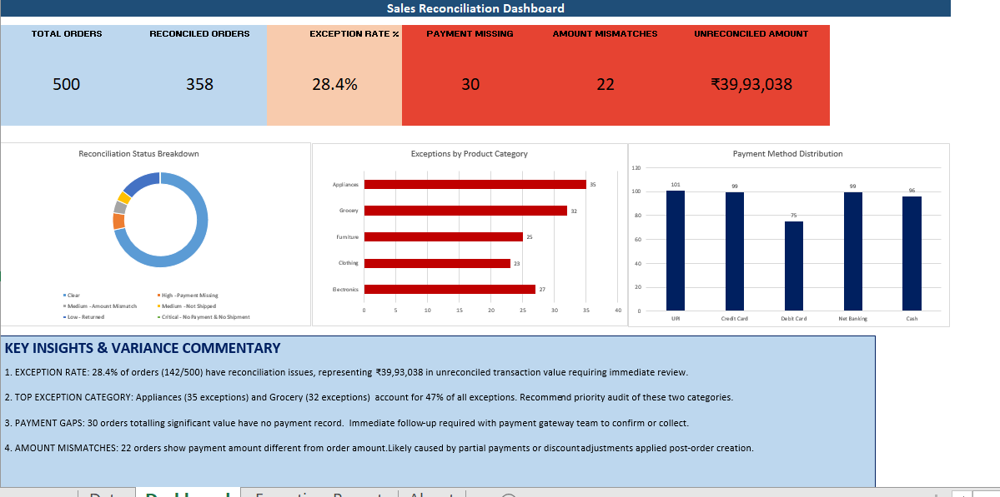

# Sales Reconciliation & Aging Tracker



## Overview
An automated reconciliation tool that integrates three source systems — 
Orders, Payments, and Shipments — to identify payment gaps, amount mismatches, 
and unshipped orders. Built using Python for data preparation and Excel 
Power Query for ETL and reporting.

## Problem Statement
Operations and finance teams spend significant time each month manually 
matching orders against payments and shipments. This tool automates that 
process — replace the source files, click Refresh All, and the dashboard 
updates instantly.

## Key Findings
- **28.4% exception rate** — 142 of 500 orders had reconciliation issues
- **₹39.9L in unreconciled transactions** requiring follow-up
- **Appliances and Grocery** categories had the highest exception concentration (47%)
- **30 orders** had no payment record — possible payment gateway failures
- **22 orders** showed amount mismatches — likely partial payments or discounts

## Dashboard Features
- 6 KPI cards: Total Orders, Reconciled Orders, Exception Rate, 
  Payment Missing, Amount Mismatches, Unreconciled Amount
- Reconciliation Status donut chart
- Exceptions by Product Category bar chart  
- Payment Method distribution column chart
- Variance commentary with actionable insights
- Exception Report sheet with severity-based conditional formatting

## Tools Used
- **Python** (Pandas, NumPy) — data generation and preprocessing
- **Excel Power Query** — ETL pipeline, 3-source merge using Left Outer Join
- **Excel** — dashboard design, KPI reporting, exception tracking

## What I Learned
- How to build a multi-source ETL pipeline in Power Query using M language
- How Left Outer Join logic works for reconciliation (matching vs unmatched records)
- How to design exception reports with severity flagging for business use
- How to structure a self-refreshing Excel reporting tool

## Project Structure
```
sales-reconciliation-tracker/
├── data/raw/
│   ├── orders.csv        
│   ├── payments.csv      
│   └── shipments.csv     
├── notebooks/
│   └── data_generation.ipynb
├── excel/
│   └── Sales_Reconciliation_Tracker.xlsx
└── README.md
```

## How to Use
1. Replace CSV files in `data/raw/` with new data
2. Open the Excel file
3. Data tab → Refresh All
4. Everything updates automatically

## Data Note
Data is synthetically generated using Python to simulate a realistic 
reconciliation scenario. Intentional mismatches were introduced to 
demonstrate exception detection logic.

## Author
Agrima | Data Analyst Portfolio Project | April 2026  
GitHub: [github.com/agrimams58](https://github.com/agrimams58)
